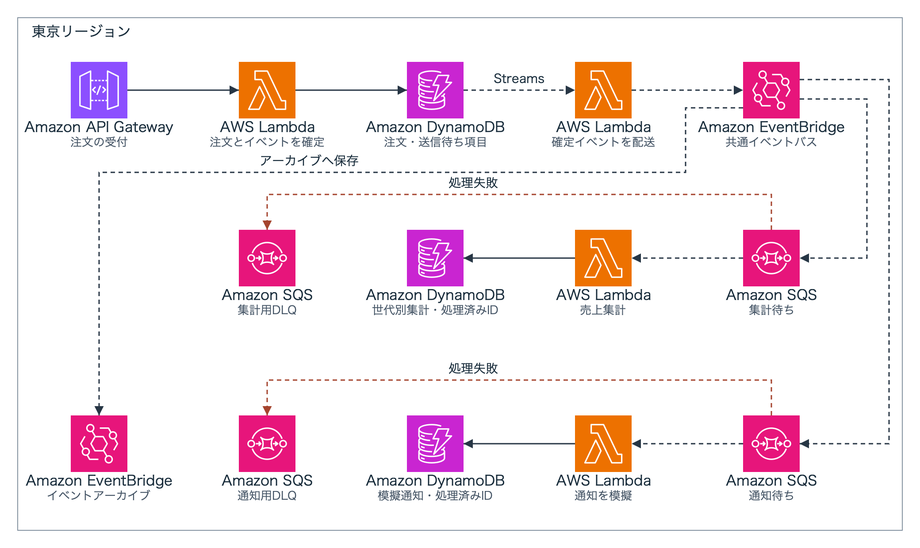
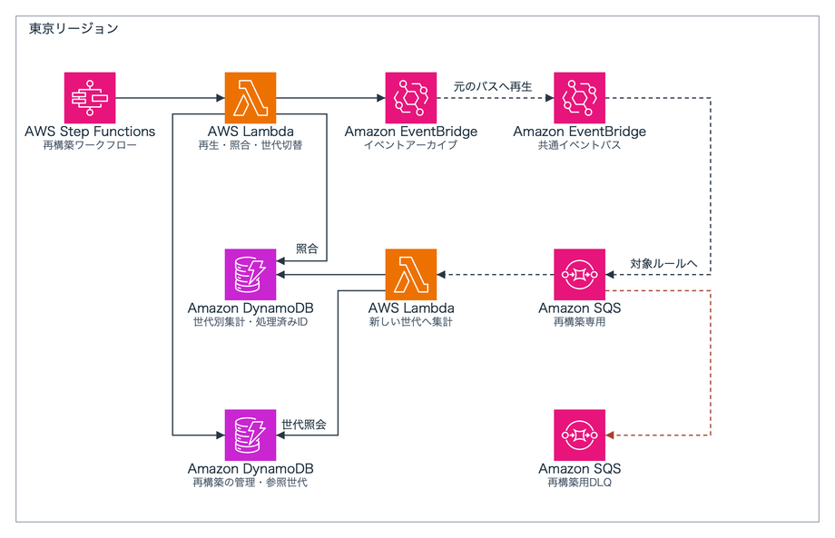

# SAMで作るOutboxと集計の再構築

注文と送信待ちイベントをDynamoDBへ同時に保存し、EventBridgeから集計と通知記録へ配信するサンプルです。集計側だけを故障させ、アーカイブの再生で新しい集計世代を作成します。通知はDynamoDBへの模擬記録であり、メールや外部サービスへの送信はありません。



再構築では新規注文の受付を一時停止し、元の集計を参照できるまま別の世代へ書き込みます。イベントIDと金額の対応、件数、合計を照合し、新世代への書き込みを止めて再確認した後に参照先を切り替えます。



## 前提

- AWS SAM CLI **1.165.0**、AWS CLI v2、Python **3.13**。
- 導入方法は[AWS SAM CLIの公式手順](https://docs.aws.amazon.com/ja_jp/serverless-application-model/latest/developerguide/install-sam-cli.html)、認証は[AWS CLIの認証設定](https://docs.aws.amazon.com/ja_jp/cli/latest/userguide/cli-chap-authentication.html)を参照してください。SAM CLIは[1.165.0のリリース](https://github.com/aws/aws-sam-cli/releases/tag/v1.165.0)を使用します。
- 東京リージョンを使用できる検証用のAWS認証。
- CloudFormation、S3、Lambda、API Gateway、DynamoDB、SQS、EventBridge、Step Functions、CloudWatch Logs、CloudWatch Alarmの作成・参照・削除権限。
- テンプレートに記載したIAMロールとインラインポリシーの管理権限、および対象ロールをLambdaとStep Functionsへ渡す `iam:PassRole`。
- APIを呼び出す主体には対象HTTP APIへの `execute-api:Invoke`、操作補助を使う主体には制御用Lambdaの呼び出し等が必要です。[権限の範囲](docs/permissions.md)を確認してください。

公開されたAPIにもIAM認証が必要です。AWS認証値、実際のアカウントID、ARN、リソース名、実行ログは公開ファイルへ保存しません。`.run/` は各自の環境で生成され、Gitの対象外です。合成注文以外のデータを入れないでください。

## SAM CLIでデプロイ

```bash
# Pythonの依存関係と、この環境専用のランダム名を用意します。
python3.13 -m venv .venv
source .venv/bin/activate
python -m pip install -r requirements.txt
python scripts/prepare.py
source .run/deploy-env.sh
```

`prepare.py` は物理名と変更セット名を一度だけ生成します。同じ環境で再実行して名前を置き換えず、作成した `.run/` を継続して使います。

```bash
# 配布物の非公開バケットをSAM CLIで作成します。
sam deploy --config-file .run/samconfig.toml --config-env bootstrap
```

配布用バケットが作成された後、本体をビルドしてデプロイします。

```bash
# 関数コードと状態機械の定義をビルドし、本体へ反映します。
sam build
sam deploy --config-file .run/samconfig.toml --config-env application
python scripts/lab.py initialize
```

### 変更セット名の補助処理

SAM CLI 1.165.0には変更セット名を渡す公開オプションがないため、`scripts/sam_hooks/sitecustomize.py` が変更セット名だけを事前生成値へ置き換えます。`source .run/deploy-env.sh` を実行したシェルでのみ有効になり、インストール済みSAM CLIのファイルは変更しません。変換、アップロード、変更セットの作成と適用、完了待ちはすべて `sam deploy` が行います。

この補助処理はSAM CLIの内部メソッドに依存します。バージョンと引数が一致しなければAWSへの作成要求前に終了します。別バージョンで使う場合はその内部APIを確認し、補助処理を更新してください。SAMの標準オプションではありません。

本体を更新・再適用するときは、`python scripts/next_changeset.py` で次の変更セット名だけを生成します。リソース名は変更しません。差分がない再適用では `sam deploy` に `--no-fail-on-empty-changeset` を追加すると正常終了します。

### コンソールの確認先

`python scripts/lab.py console-links` は、この環境の確認先を `.run/console-links.md` へ保存します。再構築を開始した後にもう一度実行すると、その実行の確認先も追加されます。このファイルには環境の識別子が含まれるため公開しません。

## 正常処理と重複配信

```bash
# 100円から1,200円までの合成注文を12件登録します。
python scripts/lab.py orders --start 1 --count 12
python scripts/lab.py status
```

非同期の配信が完了すると、注文・集計・通知記録が12件、集計金額が7,800円になります。未達の場合は数秒後に `status` を再実行します。

```bash
# 同じ業務イベントを3回追加配信し、二重加算がないか確認します。
python scripts/lab.py duplicate --order 1 --times 3
python scripts/lab.py status
```

## 集計側の障害と再構築

```bash
# 集計関数だけを故障状態にして、8件の注文を追加します。
python scripts/lab.py fault on
python scripts/lab.py orders --start 13 --count 8
python scripts/lab.py status
python scripts/lab.py queues
```

通知記録は20件へ進み、集計は12件のままです。失敗した8件は再試行後に集計用DLQへ移ります。SQSの件数は近似値のため、再構築の成否には使いません。

```bash
# 故障状態を解除し、新しい集計世代の再構築を開始します。
python scripts/lab.py fault off
python scripts/lab.py rebuild
python scripts/lab.py execution
```

状態機械は最新のOutbox送信時刻から10分経過するまで待機します。アーカイブの反映待ち後、再生先を再構築用ルールへ限定して処理します。`execution` が `SUCCEEDED` となったら照合結果を確認します。

```bash
# 新世代の集計と通知件数を確認してから、注文受付を再開します。
python scripts/lab.py status
python scripts/lab.py resume
python scripts/lab.py read-api
```

集計は20件・21,000円、通知記録は20件です。通常のルールと処理関数は再生イベントを除外し、再構築関数は再生イベントだけを受け付けます。

## 実装の境界

注文上限は1,000件、再構築開始は2回です。単一リージョン、合成注文、単純な加算集計を対象にしています。受付無停止の再構築、順序が意味を持つ状態遷移、外部通知の一度だけの送信は対象外です。SQS起点の同時実行は各2件で、Lambdaの予約済み同時実行は使用しません。

詳細は[設計と不変条件](docs/design.md)を参照してください。無料利用枠の有無にかかわらずAWSの利用料金が発生します。

## ローカル検証

```bash
# トランザクション、部分失敗、重複、世代切替の拒否条件を確認します。
python -m pip install -r requirements-dev.txt
python -m pytest
sam validate --lint --template template.yaml
```

Guardを利用できる環境では、`cfn-guard validate -d template.yaml -d bootstrap.yaml -r tests/security.guard` も実行できます。
